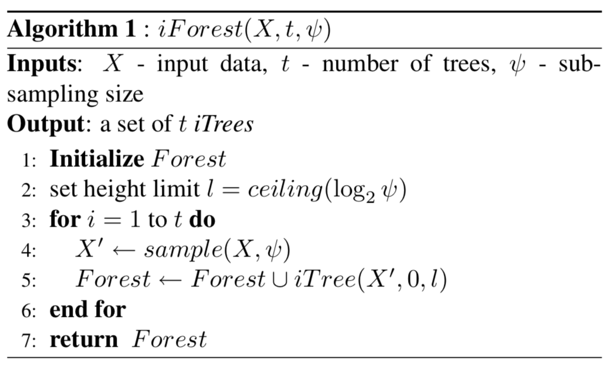
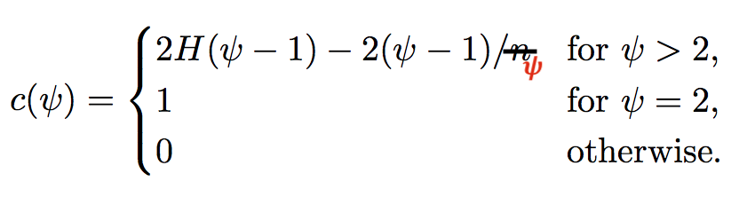

# Isolation Forest Implementation - Anomaly Detection

This is a course project for [MSDS689 Problem Solving with Python](https://github.com/parrt/msds689).

Implement the original [Isolation Forest](https://cs.nju.edu.cn/zhouzh/zhouzh.files/publication/icdm08b.pdf?q=isolation-forest) algorithm by Fei Tony Liu, Kai Ming Ting, and Zhi-Hua Zhou.  

## Data sets

You may want to test with:

* [Kaggle credit card fraud competition data set](https://www.kaggle.com/mlg-ulb/creditcardfraud); download, unzip to get `creditcard.csv`

## Visualization of normal versus anomaly separation

Using [plot_anomalies.py](https://github.com/parrt/msds689/blob/master/projects/iforest/plot_anomalies.py), you can see the results of the isolation forest trying to detect anomalies. 

<table border="0">
<tr><td>http.csv, 200 trees, 99% desired TPR</td></tr>
<tr>
<td border=0>

</tr>
</table>

## Algorithm

here are the algorithms extracted from the Liu *et al* paper:

<table border="0">
<tr>
<td width="50%" valign="top"></td><td width="50%" valign="top"></td>
</tr>
<tr>
<td valign="top">

</td>
<td valign="top">
average path length <tt>c()</tt>, not the one in the original paper: 

scoring formula: 

</td>
</tr>
</table>

